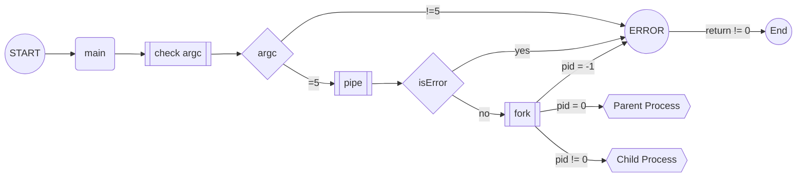
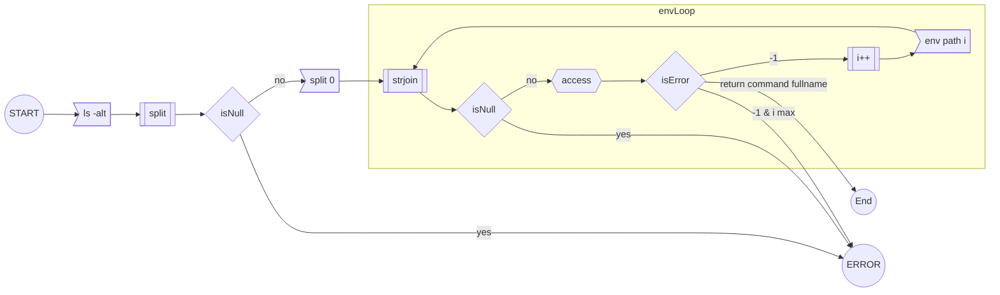
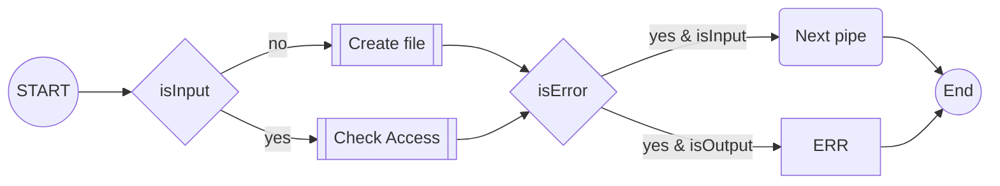

# 42\_pipex

## Content
- [Historic :clock7:](#historic-clock7)
- [Introduction :traffic\_light:](#introduction-traffic_light)
- [ToDo - Mandatory :key:](#todo---mandatory-key)
- [What will happen if :interrobang:](#what-will-happen-if-interrobang)
- [How it works](#how-it-works)
- [Use cases](#use-cases)
- [Sources :link:](#sources-link)

## Historic :clock7:
[Go to content](#content)  
|Date _YYYY-MM-DD_|Description|
|:-|:-|
|2022-05-03|Add "git" and template\_commit|
|2022-03-04|Init|

## Introduction :traffic\_light:
[Go to content](#content)  
**Expectation:**  
Mandatory :key:: `./pipex file1 cmd1 cmd2 file2`  
Bonus :moneybag:: `./pipex file1 cmd1 cmd2 cmd3 ... cmdn file2` 

:warning: _The command is in double quote and can contain parameters_

Example:
`./pipex infile "ls -l" "wc -l" outfile` equal to `< infile ls -l | wc -l > outfile`  
`./pipex infile "grep a1" "wc -w" outfile` equal to `< infile grep a1 | wc -w > outfile`  

**Original:**  
Mandatory :key:: `< file1 cat | wc -l > file2`  
Bonus :moneybag:: `< file1 cat | wc -l | head > file2` 

:interrobang: _Command can not be something else than file descriptor commands ?_

## ToDo - Mandatory :key:
[Go to content](#content)  
### Main
- [ ] In the main function, add a third argument `char ** envp` to get a list of environment path
```c
int	main(int argc, char **argv, char **envp)
{
	...
	return (0);
}
```

### Parsing
[Go to content](#content)  
:warning: **_If file does not exist or has no expected permission, the pipe chain is broken and continues to the next working pipe_**  
- [ ] Arguments
	- [ ] Only five arguments
	- [ ] 2nd and last arguments are filenames
	- [ ] 3rd and 4th arguments are commands
	- [ ] 2nd argument is input file
	- [ ] Last argument is output file
- [ ] Files
	- [ ] Check access permission with `access(const char *pathname, int mode)` where mode = R\_OK & W\_OK
	- [ ] If permission error on input file, put error message but go to next pipe
	- [ ] If permission error on output file, put error mesage and stop the program
- [ ] Commands
	- [ ] Split the command to get the command and its parameters
	- [ ] Check access permission with `access(const char *pathname, int mode)` where mode = X\_OK`  
	- [ ] Check if binary command with `execve(const char *pathname, char *const argv\[\],char \*const envp\[\])`
- [ ] Pipe
	- [ ] Calcualte total of pipe
```
nPipe = nCmd - 1
nPipe = (argc - argv[0] - argv[1] - argv[last]) - 1
```
**Exemple:**
```
< file1 "cat" | "wc -c" > file2
./pipex file1 "cat" "wc -c" file2

nPipe = (5 - 1 - 1 - 1) - 1
nPipe = 1
```
:warning: _The priority of error in a pipe is : file, command_  
:warning: _The priority of catargument is more important than stdin_
:bangbang: _Use open "O_DIRECTORY" to know if the object is a directory_  
:bangbang: _Use open "O_CREAT" to create the output file_  

**GLOBAL**


**Get command fullname**




**Check access**


### Commands execution
[Go to content](#content)  
:warning: _The command execve replace the actual process_

:warning: _Do "execve" one time to test relative path and i return -1, do a second time "execve" with absolue path by suing envp_

## File commands
[Go to content](#content)  
- pwd
- cat
- wc
- mv
- grep

## What will happen if :interrobang:
[Go to content](#content)  
- The command is the full path
`< file1 "/usr/bin/ls" | "/usr/bin/cat" > file2`  
- The file and/or command is a symbolic link
:pushpin: _Symbolic link file works with F_OK_
- The inputfile is /dev/zero_
`< /dev/zero "cat" | "wc -l" > /dev/urandom`  
`< /dev/zero "cat" | "wc -l" > /dev/null`  
> Example with /dev/zero file: `cat /dev/zero | xx`  
- The binary command is not working, get a return value
- The inputfile is a directory
`< file1 cat | wc -l > directory`   

## How it works
[Go to content](#content)  
### exceve
**Synopsis:**
```c
\#include <unistd.h>
int execve(const char *pathname, char *const argv[], char *const envp[]);
```

**Detail:**
`pathname` : is the binary command full path
`argv` : is the pointer of the command following by its argument
`envp` : is environment passed to the new program

> Exemple:
```c
int	main(int argc, char **argv, char **envp)
{
	...
	execve(argv[1], &argv[1], envp);
	...
}
```
```shell
./pipex /usr/bin/ls "-alt"
```
:warning: _argv from execve is `&argv[1]` because of adress shifting then &argv[1] = /usr/bin/ls "-alt"

> Result:
```shell
total 48
-rwxr-xr-x  1 abarrier 2021_paris 17864 May  4 10:28 pipex
drwxr-xr-x  6 abarrier 2021_paris  4096 May  4 10:28 .
drwxr-xr-x  2 abarrier 2021_paris  4096 May  4 10:28 obj
drwxr-xr-x  3 abarrier 2021_paris  4096 May  4 10:28 srcs
drwxr-xr-x  2 abarrier 2021_paris  4096 May  4 10:11 include
drwxr-xr-x 12 abarrier 2021_paris  4096 May  4 10:03 libft
drwxr-xr-x  5 abarrier 2021_paris  4096 May  4 09:56 ..
-rw-r--r--  1 abarrier 2021_paris  1592 May  4 09:28 Makefile
```

## Use cases
[Go to content](#content)  
### Use case "ok"
`< file1 cat | wc -l > file2`  

### Use case "file and command error, permission"
`< fvdile1 sdvfdbdf | bdfbvvb "YOYOYOYOY" | wc -l > test4/file20`  
**result:**
```shell
zsh: no such file or directory: fvdile1
zsh: command not found: bdfbvvb
zsh: permission denied: test4/file20
```

## Sources :link:
[Go to content](#content)  
### Access
- https://www.geeksforgeeks.org/access-command-in-linux-with-examples/

### Fork
- https://www.geeksforgeeks.org/c-program-demonstrate-fork-and-pipe/

### Pipe
- https://github.com/dams333/42-cursus/blob/master/minishell/README.md#pipe
- http://www.idc-online.com/technical_references/pdfs/information_technology/How_Linux_pipes_work_under_the_hood.pdf
- http://web.cse.ohio-state.edu/~mamrak.1/CIS762/pipes_lab_notes.html
