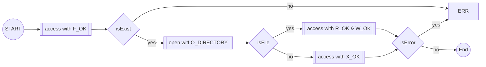
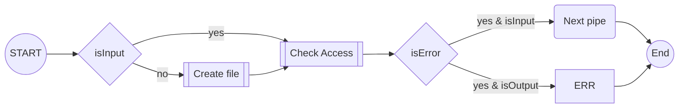

# 42\_pipex

## Content
- [Historic :clock7:](#historic-clock7)
- [Introduction :traffic\_light:](#introduction-traffic_light)
- [ToDo - Mandatory :key:](#todo---mandatory-key)
- [Use cases](#use-cases)
- [Sources :link:](#sources-link)

## Historic :clock7:
[Go to content](#content)  
|Date _YYYY-MM-DD_|Description|
|:-|:-|
|2022-05-03|Add "git" and template\_commit|
|2022-03-04|Init|

## Introduction :traffic\_light:
[Go to content](#content)  
**Expectation:**  
Mandatory :key:: `./pipex file1 cmd1 cmd2 file2`  
Bonus :moneybag:: `./pipex file1 cmd1 cmd2 cmd3 ... cmdn file2` 

:warning: _The command is in double quote and can contain parameters_

Example:
`./pipex infile "ls -l" "wc -l" outfile` equal to `< infile ls -l | wc -l > outfile`  
`./pipex infile "grep a1" "wc -w" outfile` equal to `< infile grep a1 | wc -w > outfile`  

**Original:**  
Mandatory :key:: `< file1 cat | wc -l > file2`  
Bonus :moneybag:: `< file1 cat | wc -l | head > file2` 

:interrobang: _Command can not be something else than file descriptor commands ?_

## ToDo - Mandatory :key:
[Go to content](#content)  
### Main
- [ ] In the main function, add a third argument `char ** envp` to get a list of environment path
```
int	main(int argc, char **argv, char **envp)
{
	...
	...
	return (0);
}
```

### Parsing
:warning: **_If file does not exist or has no expected permission, the pipe chain is broken continues to the next working pipe_**  
- [ ] Arguments
	- [ ] Only five arguments
	- [ ] 2nd and last arguments are filenames
	- [ ] 3rd and 4th arguments are commands
	- [ ] 2nd argument is input file
	- [ ] Last argument is output file
- [ ] Files
	- [ ] Check access permission with `access(const char *pathname, int mode)` where mode = R\_OK & W\_OK
	- [ ] If permission error on input file, put error message but got to next pipe
	- [ ] If permission error on output file, put error mesage and stop the program
- [ ] Commands
	- [ ] Split the command to get the command and its parameters
	- [ ] Check access permission with `access(const char *pathname, int mode)` where mode = X\_OK`  
	- [ ] Check if binary command with `execve(const char *pathname, char *const argv[],char *const envp[])`  
:warning: _The priority of error in a pipe is : file, command
:pushpin: _Symbolic link file works with F_OK_
:interrobang: _What will happen if:
- The command is the full path
`< file1 "/usr/bin/ls" | "/usr/bin/cat" > file2`  
- The file and/or command is a symbolic link
- The inputfile is /dev/zero_
`< /dev/zero "cat" | "wc -l" > /dev/urandom`  
`< /dev/zero "cat" | "wc -l" > /dev/null`  
> :pushpin: Example with /dev/zero file: `cat /dev/zero | xx`  
- The inputfile is a directory
`< file1 cat | wc -l > directory`   
:bangbang: _Use open "O_DIRECTORY" to know if the object is a directory_
:bangbang: _Use open "O_CREAT" to create the output file_




### Commands execution
:interrobang: _What will happen if the binary command is not working, get a return value_ 

:warning: _The command execve replace the actual process_

## File commands
[Go to content](#content)  
- pwd
- cat
- wc
- mv
- grep

## Use cases
[Go to content](#content)  
### Use case "ok"
`< file1 cat | wc -l > file2`  

### Use case "file and command error, permission"
`< fvdile1 sdvfdbdf | bdfbvvb "YOYOYOYOY" | wc -l > test4/file20`
**result:**
```
zsh: no such file or directory: fvdile1
zsh: command not found: bdfbvvb
zsh: permission denied: test4/file20
```

## Sources :link:
[Go to content](#content)  
### Access
- https://www.geeksforgeeks.org/access-command-in-linux-with-examples/

### Fork
- https://www.geeksforgeeks.org/c-program-demonstrate-fork-and-pipe/

### Pipe
- https://github.com/dams333/42-cursus/blob/master/minishell/README.md#pipe
- http://www.idc-online.com/technical_references/pdfs/information_technology/How_Linux_pipes_work_under_the_hood.pdf
